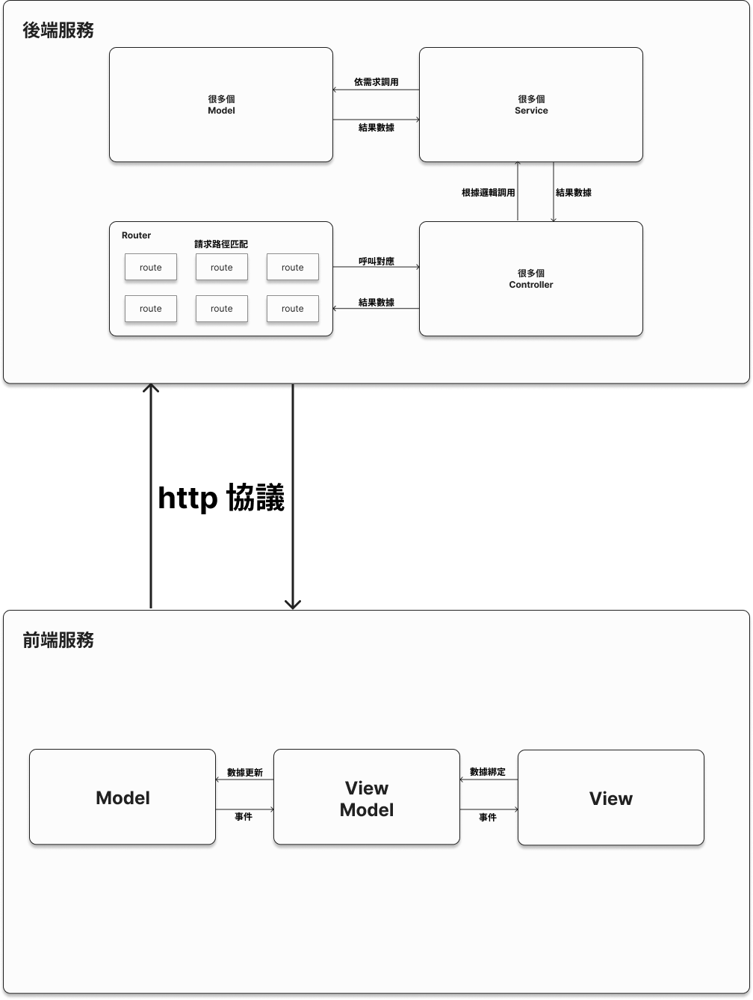

# 第八組 帳本
這是一個基於MVC架構、前後端分離的專案。具備完整 CRUD 功能的全端應用程式，整合前端與後端，並串接資料庫進行資料操作。

### 功能
* Create: 新增資料 insertOne
* Read: 查詢資料 getAllAccounts
* Update: 更新資料 updateBalanceById
* Delete: 刪除資料 deleteById

### 安裝與執行指引
#### 環境需求
* 前端開發 : React + ts
* 後端開發 : Node.js + Express
* 資料庫 : MongoDB
* API測試 : PostMan
* 安裝套件 : npm

### API 規格說明
#### API 基本資訊
* Base URL : /api/v1/user/
* 格式 : JSON

### 架構圖 : 展示前端、後端、資料庫及其互動

### 流程圖：描述 CRUD 功能的操作流程。

* 查詢所有帳戶: GET=> /api/v1/user/getAllAccounts
* 插入帳戶: POST=> /api/v1/user/insertOne
* 刪除帳戶: DELETE=> /api/v1/user/deleteById
* 更新帳戶餘額: PUT=> /api/v1/user/updateBalanceById

#### 流程解說

1. 用戶操作前端界面：用戶在 React 前端界面上提交表單或點擊按鈕（新增、查詢、更新或刪除學生資料）。

2. 前端處理請求：前端透過 Fetch，向後端 Express 伺服器發送 HTTP 請求（如 POST、GET、PUT、DELETE）。

3. 後端路由匹配：後端根據請求的路徑和方法，在路由層 (Route) 找到對應的控制器方法。

4. 控制器處理請求邏輯：控制器 (Controller) 接收請求，調用服務層 (Service)，執行業務邏輯（如驗證學生資料、格式化數據等）。

5. 服務層與數據模型交互：服務層負責與數據模型 (Model) 交互，進行資料庫操作（如新增、查詢、更新或刪除）。

6. 數據模型與 MongoDB 交互：數據模型 (Model) 使用 Mongoose 與 MongoDB 進行資料交互，完成對數據庫的增、刪、改、查操作。

7. 結果返回：最終結果從數據庫返回給控制器，再經由路由層返回給前端。

8. 前端界面更新：前端接收後端的回應數據，更新界面顯示或彈出提示。